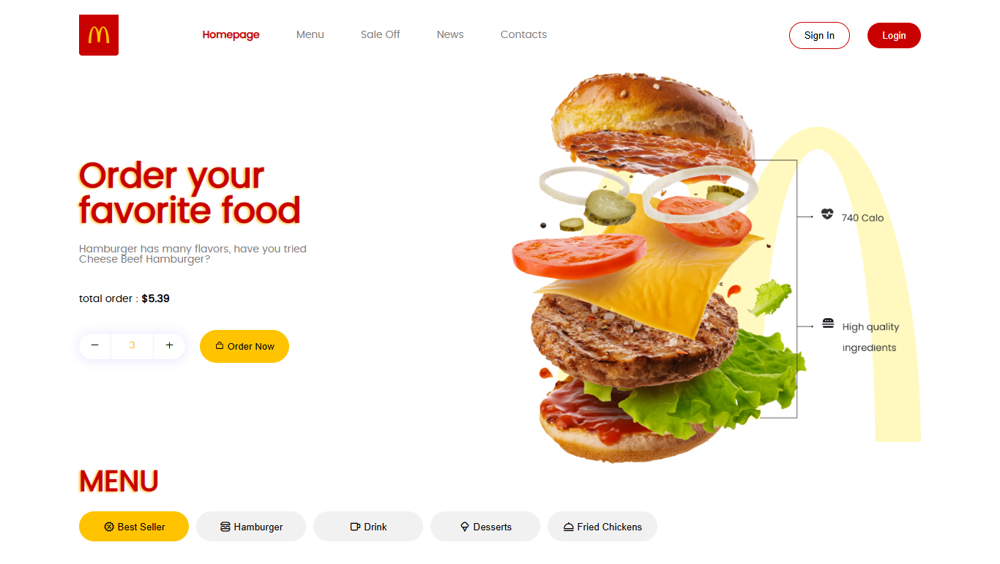

# 🍔 McDonald's Website Redesign - Fully Responsive HTML & CSS Project

Hey!  
This is a **fully responsive redesign** of the McDonald’s landing page built with **pure HTML and CSS** — no JavaScript involved.  
My goal was to reimagine the brand’s visual identity in a **cleaner, more modern, and minimalistic** way while staying true to its iconic vibe.

## 🎯 Key Features

- ✅ 100% Responsive (Mobile, Tablet, Desktop)
- 🎨 Minimal & modern UI with clean layout
- 💅 Pixel-perfect structure using Flexbox & Grid
- ✨ CSS-only interactivity (hover, animations, etc.)
- 📱 Mobile-first approach

## 🚀 Live Demo
[see the demo](https://mcdonalds-redesign-sn.vercel.app/)

 

If you have any thoughts or suggestions, feel free to open an issue or reach out ✌️

### 🔗 Follow me for more:
- GitHub: [@sadranafe](https://github.com/sadranafe)
- Instagram: [@teccctt](https://instagram.com/teccctt) -> bussiness account
